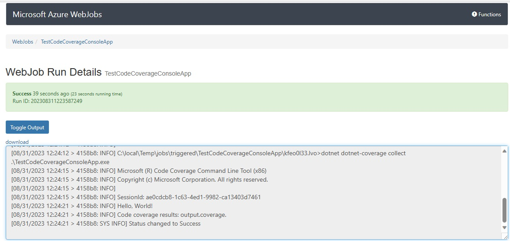
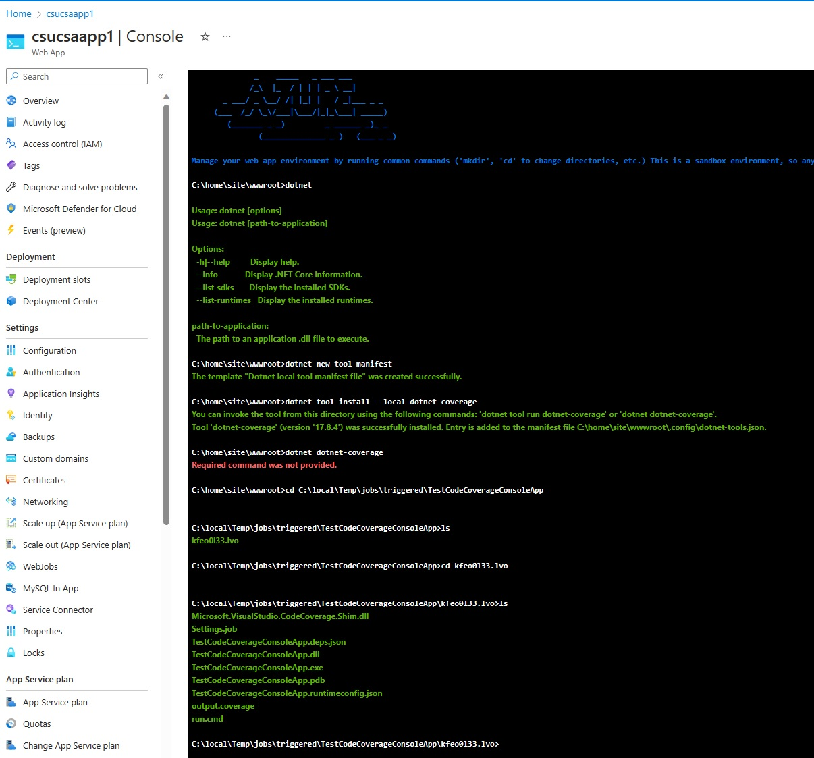

# Test Code Coverage running within App Service WebJob

## Problem

Run (Test) Code Coverage from within Azue DevOps Pipeline in order to run the Acceptance Automated Tests on Azure App Service - WebJob.
Altenratevely the tests could be run on the hosted (or self-hosted) agent but running them on the App Service - WebJob is closer to the production environment (e.g. WebJob process may have different run behaviour, environmental variables, etc) 

## Solution Options

### Option 1 - Run the job with parameters

When WebJob is packaged with run.cmd, this command becomes the main entry point. The run.cmd can start a dotnet app by providing parameters or by wrapping the execution with dotnet dotnet-coverage collect command.
The dotnet dotnet-coverage collect produces output and save it within the App Service temporary files "local" (e.g. C:\local\Temp\jobs\triggered\TestCodeCoverageConsoleApp\kfeo0l33.lvo)
If enabled, the files can be accessed via FTP protocol as described here https://github.com/projectkudu/kudu/wiki/Accessing-files-via-ftp
Otherwise, the file can be copied by using command in the run.cmd and saved to one of the folder of the shared file storage system as described here https://github.com/projectkudu/kudu/wiki/Understanding-the-Azure-App-Service-file-system. Such shared file can be accessed by using Azure Storage REST API or Storage File Explorer tool.

Log file for WebJob executed with dotnet-coverage tool

App Service interactive console,  invocation of dotnet tool install and look into the WebJob execution temp folder 

## References

- https://learn.microsoft.com/en-us/dotnet/core/additional-tools/dotnet-coverage
- https://github.com/projectkudu/kudu/wiki/Understanding-the-Azure-App-Service-file-system